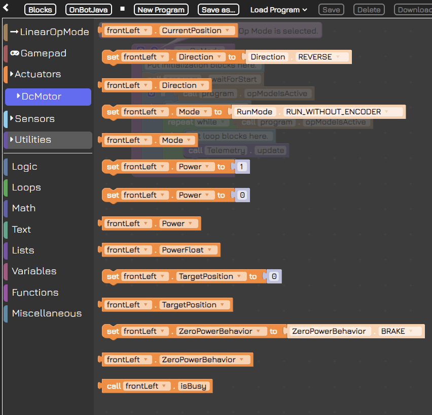
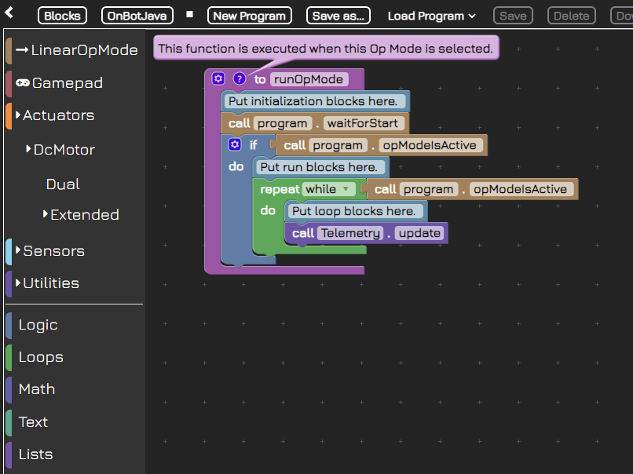
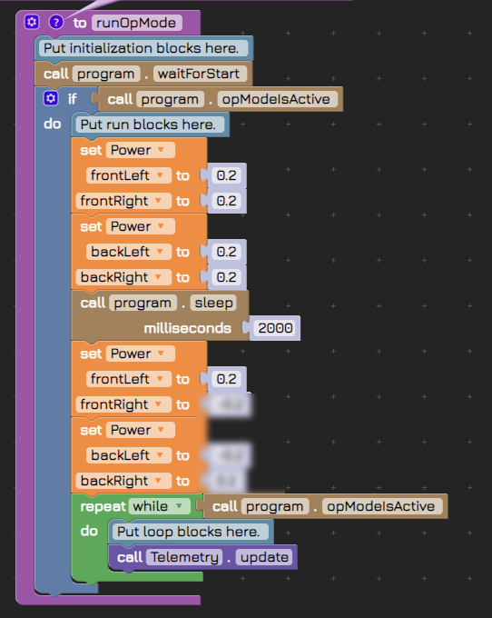

# What are blocks?

## What is code?

Have you ever wondered how humans tell machines what to do? Machines might seem to work via magic, but that “magic” is actually thousands of lines of computer code.

Computer Code is how humans talk to computing machines, which nowadays include desktop computers, laptop, phones, tablets, video game systems, robots, satellites… and the list goes on!

At the heart of all these machines are microprocessors, which is the “brain” of a machine. Unlike our brains which evolved over billions of years, machine brains were created by human scientists over about a century.

Microprocessors control the flow of electricity in a computing machine, and by “talking” to them we can tell them what to do. Microprocessors might tell a light to turn on, a phone to vibrate, the color of pixels, or a robot to start moving.

You might think the image at the top of this page looks like garbleegook if you’ve never written a programming language before, but the “machine code” that speaks directly to microprocessors looks even worse!

Computer programming languages like JAVA, Python, and C++ allow humans to write machine code in a language they can understand.

## Enter blocks

Teachers of Computer Programming noticed that it was difficult for students to “climb the first hill” of learning a programming language because it was too much new information at once, so they thought of a new way to teach the concepts of computer programming: programming blocks.

Programming blocks combine the simplicity of building block toys like Legos, with the power of writing a programming language like JAVA. By stacking and combining blocks in the right order, students are able to write computer code that a computing machine, like a robot, can understand.

“Behind the Scenes” the blocks are translated first into a programming language (JAVA for our application) and from there into code that controls a machine. While the Virtual Robot Simulator uses a virtual robot, the computers that run VRS interpret machine code in a similar way to the physical robot– they just control the virtual parts instead of physical parts, otherwise the code is the same.

## The future of blocks

While blocks were developed initially as a way for students to have a comfortable introduction to writing programming languages, they have become a method of programming that is independent from coursework. Many Integrated Development Environments such as Unity (the IDE we used to build the Virtual Robot Simulator) and the Unreal Engine (the IDE used to build popular games like Fortnight) have visual programming languages that are similar to blocks programming. These languages tend to use a “node-based” language instead of a “blocks-based” language, but the idea is the same.

Whether you are hoping to learn a programming language, learn programming concepts, or build your skills at visual programming, block coding with the Virtual Robot Simulator is a great place to start!

# Do I need ALL these blocks?

You might notice that there are quite a few blocks available to use. Do you really need all of them?

Actuators, Logic, Loops, Math, Text, Lists… there are quite a few different block categories, and within those, there are lots of blocks. Where do you even start?

The key to learning most things, including blocks programming, is to start with simple tasks and then figure out how to use the tools provided to accomplish those tasks. If you start with learning every tool, you’ll have forgotten them by the time you need to use them, so instead focus on a few at a time.

Our first task will be to move the robot forward and backwards.

# Writing your first blocks program

Let’s take a look at the default code template we see when we load up the program for the first time and select “Autonomous Mode”

Here’s what each block means:

|Code Block|Meaning|
|--|--|
|to runOpMode|The “OpMode” is the Operation Mode for the robot. When you load this program, this let’s the robot know to “run” every command inside this block.|
|Put initialization block here|This is a comment to tell you where to put blocks that are the “startup” blocks for the robot– what happens before it starts to move, shoot discs, etc.|
|call Program waitForStart|This is a default program that waits for the robot to signal it is ready to start.|
|if call Program opModeIsActive|Once the robot is ready, it will signal back to the code with the “opModeIsActive” signal, letting the program know to send the blocks of code within this “if” block.|
|Put run blocks here.|This is a comment to let you know where to put blocks that should run a signal time.|
|Repeat while call Program opModeIsActive|This block repeats continually while the opModeIsActive signal is received from the robot.|
|Put loop blocks here.|This is a comment to let you know where to put blocks that should repeat continually.|
|call Telemetry update|This is where the magic happens– your code actually updates motors and actuators on the robot and the robot (or virtual robot in this case) moves accordingly. Then the whole “Repeat” block runs again.|

# Setting motor power

The following code blocks drive the robot forward for two seconds at a power of 0.2. After that we want it to strafe to the right. If we set the frontLeft power to 0.2, what would we set the other values to? Try this out in the app and then come back here to see the answer.

Aha! We hope you see that exploring the blocks in your toolbox often reveals a better way to accomplish a task.

## What power should I use?

Often in programming you need to set a value. Sometimes you have the opportunity to define what that value means before setting it, but often you have to work within the constraints of the existing software. In this case, the “power” value we “set” for each wheel is determined by the VRS App. The only way you can figure out what the power should be is to experiment. Remember: in most cases you don’t have to use whole numbers only; numbers can be negative, decimals, or both!

## What now?

Ok so we’ve successfully set the power of motors, now what? Well, if we simply wanted a robot that rams things at high speed, we are done. Most of the time, though, we want our robots to behave a bit more deliberately, so we need to introduce some more commands so our robot will move forward AND backward AND forward again (as many times for as far a distance as we want).

Now that you understand how to stack code blocks to make the virtual robot move, you can make it go forward and backwards. Try it yourself in the app, then return here to see the way we did it.

# What causes a turn?

Turning is easy if you’re driving a car– you just turn the wheel and the wheels (connected by the steering axle and some gears) turn to point in the direction you want the car to go. Turning the virtual robot is… not so straightforward.

Try to imagine how you might turn the robot, then match the words in this quiz to complete the idea correctly.

You can control the strength of the turn, also known as the turn radius, by adjusting the strength of these values. Which of the following would execute the tightest (smallest radius) turn?

# What is strafing

A “strafe” maneuver might be familiar to you if you’ve ever played a First Person Shooter-style video game. Your character typically moves forward and backward using the left thumbstick up and down directions (or W and S on a keyboard), and looks around using the right thumbstick (or the mouse if you’re using a mouse). Your character “strafes” when using left and right on a thumbstick (or A and D on a keyboard). It’s just another way of saying “move side to side without turning”.

The robot (both real and virtual) uses special wheels that allow it to strafe when all four turn in the correct direction in relation to each other. Those who want to try and figure it out on their own should use the app and experiment with different values.

# How to learn Java using blocks

As we learned in the introductory lesson, code blocks are a method for writing code. Just as a programming language like Java provides programmers a way to write machine code in a more understandable way, code blocks provide a way to write Java in a more understandable way. It is not necessary to learn Java– coding blocks are a completely viable method for controlling the robot, but for those who are interested in learning Java for its power and versatility, code blocks are an excellent learning tool.

The VRS app allows you to switch back and forth between blocks and Java at the click of a button. This enables you to see the Java code you have created using the blocks, and understand its syntax.